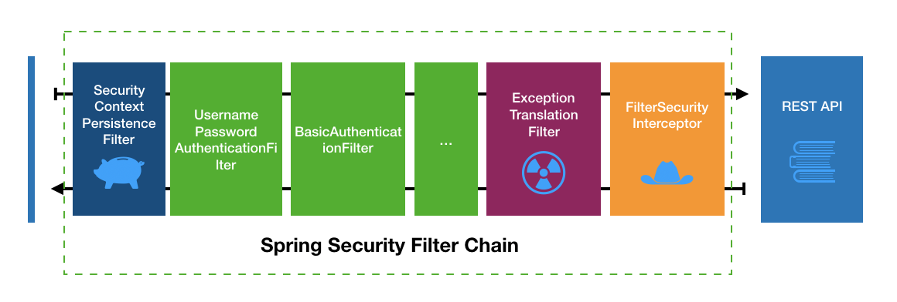

认证流程
===



一个认证过程，其实就是过滤器链上的一个绿色矩形Filter所要执行的过程。  

基本的认证过程有三步骤：
1. Filter拦截请求，生成一个未认证的`Authentication`，交由`AuthenticationManager`进行认证；
2. `AuthenticationManager`的默认实现`ProviderManager`会通过`AuthenticationProvider`对`Authentication`进行认证，其本身不做认证处理；
3. 如果认证通过，则创建一个认证通过的`Authentication`返回；否则抛出异常，以表示认证不通过。

要理解这个过程，可以从类`UsernamePasswordAuthenticationFilter`，`ProviderManager`，`DaoAuthenticationProvider`和`InMemoryUserDetailsManager`（`UserDetailsService`实现类，由`UserDetailsServiceAutoConfiguration`默认配置提供）进行了解。只要创建一个含有`spring-boot-starter-security`的springboot项目，在适当地打上断点接口看到这个流程。

用认证部门进行讲解
---

  

请求到`前台`之后，负责该请求的`前台`会将请求的内容封装为一个`Authentication`对象交给`认证管理部门`，`认证管理部门`仅管理`认证部门`，不做具体的认证操作，具体的操作由与该`前台`相关的`认证部门`进行处理。当然，每个`认证部门`需要判断`Authentication`是否为该部门负责，是则由该部门负责处理，否则交给下一个部门处理。`认证部门`认证成功之后会创建一个认证通过的`Authentication`返回。否则要么抛出异常表示认证不通过，要么交给下一个部门处理。

如果需要新增认证类型，只要增加相应的`前台(Filter)`和与该`前台(Filter)`想对应的`认证部门(AuthenticationProvider)`就即可，当然也可以增加一个与已有前台对应的`认证部门`。`认证部门`会通过`前台`生成的`Authentication`来判断该认证是否由该部门负责，因而也许提供一个两者相互认同的`Authentication`.  

`认证部门`需要人员资料时，则可以从`人员资料部门`获取。不同的系统有不同的`人员资料部门`，需要我们提供该`人员资料部门`，否则将拿到空白档案。当然，`人员资料部门`不一定是唯一的，`认证部门`可以有自己的专属`资料部门`。

上图还可以有如下的画法：

  

这个画法可能会和FilterChain更加符合。每一个前台其实就是FilterChain中的一个，客户拿着请求逐个前台请求认证，找到正确的前台之后进行认证判断。  

## 前台（Filter）

这里的`前台Filter`仅仅指实现认证的Filter，Spring Security Filter Chain中处理这些Filter还有其他的Filter，比如`CsrfFilter`。如果非要给角色给他们，那么就当他们是`保安人员`吧。  

Spring Security为我们提供了3个已经实现的Filter。`UsernamePasswordAuthenticationFilter`，`BasicAuthenticationFilter`和 `RememberMeAuthenticationFilter`。如果不做任何个性化的配置，`UsernamePasswordAuthenticationFilter`和`BasicAuthenticationFilter`会在默认的过滤器链中。这两种认证方式也就是默认的认证方式。  

`UsernamePasswordAuthenticationFilter`仅仅会对`/login`路径生效，也就是说`UsernamePasswordAuthenticationFilter`负责发布认证，发布认证的接口为`/login`。

```java
public class UsernamePasswordAuthenticationFilter extends
		AbstractAuthenticationProcessingFilter {
	...
	public UsernamePasswordAuthenticationFilter() {
		super(new AntPathRequestMatcher("/login", "POST"));
	}
	...
}
```

`UsernamePasswordAuthenticationFilter`为抽象类`AbstractAuthenticationProcessingFilter`的一个实现，而`BasicAuthenticationFilter`为抽象类`BasicAuthenticationFilter`的一个实现。这四个类的源码提供了不错的`前台(Filter)`实现思路。  

**AbstractAuthenticationProcessingFilter**  

`AbstractAuthenticationProcessingFilter` 提供了认证前后需要做的事情，其子类只需要提供实现完成认证的抽象方法`attemptAuthentication(HttpServletRequest, HttpServletResponse)`即可。使用`AbstractAuthenticationProcessingFilter`时，需要提供一个拦截路径（使用`AntPathMatcher`进行匹配）来拦截对应的特定的路径。

**UsernamePasswordAuthenticationFilter** 

`UsernamePasswordAuthenticationFilter`作为实际的前台，会将客户端提交的username和password封装成一个`UsernamePasswordAuthenticationToken`交给`认证管理部门(AuthenticationManager)`进行认证。如此，她的任务就完成了。

**BasicAuthenticationFilter**  
该`前台(Filter)`只会处理含有`Authorization`的Header，且小写化后的值以`basic`开头的请求，否则该`前台(Filter)`不负责处理。该Filter会从header中获取Base64编码之后的username和password，创建`UsernamePasswordAuthenticationToken`提供给`认证管理部门(AuthenticationMananager)`进行认证。

## 认证资料（Authentication）
`前台`接到请求之后，会从请求中获取所需的信息，创建自家`认证部门(AuthenticationProvider)`所认识的`认证资料(Authentication)`，`认证部门(AuthenticationProvider)`则主要是通过`认证资料(Authentication)`的类型判断是否由该部门处理。  

```java
public interface Authentication extends Principal, Serializable {
	
	// 该principal具有的权限。AuthorityUtils工具类提供了一些方便的方法。
	Collection<? extends GrantedAuthority> getAuthorities();
	// 证明Principal的身份的证书，比如密码。
	Object getCredentials();
	// authentication request的附加信息，比如ip。
	Object getDetails();
	// 当事人。在username+password模式中为username，在有userDetails之后可以为userDetails。
	Object getPrincipal();
	// 是否已经通过认证。
	boolean isAuthenticated();
	// 设置通过认证。
	void setAuthenticated(boolean isAuthenticated) throws IllegalArgumentException;
}
```

在`Authentication`被认证之后，会保存到一个thread-local的SecurityContext中。
```java
// 设置
SecurityContextHolder.getContext().setAuthentication(anAuthentication);
// 获取
Authentication existingAuth = SecurityContextHolder.getContext()
				.getAuthentication();
```
在写`前台Filter`的时候，可以先检查`SecurityContextHolder.getContext()`中是否已经存在通过认证的`Authentication`了，如果存在，则可以直接跳过该Filter。已经通过验证的`Authentication`建议设置为一个不可修改的实例。

目前从`Authentication`的类图中看到的实现类，均为`Authentication`的抽象子类`AbstractAuthenticationToken`的实现类。实现类有好几个，与前面的讲到的Filter相关的有`UsernamePasswordAuthenticationToken`和`RememberMeAuthenticationToken`。    

`AbstractAuthenticationToken`为`CredentialsContainer`和`Authentication`的子类。实现了一些简单的方法，但主要的方法还需要实现。该类的`getName()`方法的实现可以看到常用的principal类为`UserDetails`、`AuthenticationPrincipal`和`Princial`。如果有需要将对象设置为principal，可以考虑继承这三个类中的一个。
```java
public String getName() {
	if (this.getPrincipal() instanceof UserDetails) {
		return ((UserDetails) this.getPrincipal()).getUsername();
	}
	if (this.getPrincipal() instanceof AuthenticatedPrincipal) {
		return ((AuthenticatedPrincipal) this.getPrincipal()).getName();
	}
	if (this.getPrincipal() instanceof Principal) {
		return ((Principal) this.getPrincipal()).getName();
	}

	return (this.getPrincipal() == null) ? "" : this.getPrincipal().toString();
}
```

## 认证管理部门(AuthenticationManager)

`AuthenticationManager`是一个接口，认证`Authentication`，如果认证通过之后，返回的`Authentication`应该带上该principal所具有的`GrantedAuthority`。  

```java
public interface AuthenticationManager {
	Authentication authenticate(Authentication authentication)
			throws AuthenticationException;
}
```

该接口的注释中说明，必须按照如下的异常顺序进行检查和抛出：

1. `DisabledException`：账号不可用
2. `LockedException`：账号被锁
3. `BadCredentialsException`：证书不正确

Spring Security提供一个默认的实现`ProviderManager`。`认证管理部门(ProviderManager)`仅执行管理职能，具体的认证职能由`认证部门(AuthenticationProvider)`执行。

```java
public class ProviderManager implements AuthenticationManager, MessageSourceAware,
		InitializingBean {
	...

	public ProviderManager(List<AuthenticationProvider> providers) {
		this(providers, null);
	}

	public ProviderManager(List<AuthenticationProvider> providers,
			AuthenticationManager parent) {
		Assert.notNull(providers, "providers list cannot be null");
		this.providers = providers;
		this.parent = parent;
		checkState();
	}

	public Authentication authenticate(Authentication authentication)
			throws AuthenticationException {
		Class<? extends Authentication> toTest = authentication.getClass();
		AuthenticationException lastException = null;
		AuthenticationException parentException = null;
		Authentication result = null;
		Authentication parentResult = null;
		boolean debug = logger.isDebugEnabled();

		for (AuthenticationProvider provider : getProviders()) {
			// #1, 检查是否由该认证部门进行认证`AuthenticationProvider`
			if (!provider.supports(toTest)) {
				continue;
			}

			if (debug) {
				logger.debug("Authentication attempt using "
						+ provider.getClass().getName());
			}

			try {
				// #2, 认证部门进行认证
				result = provider.authenticate(authentication);

				if (result != null) {
					copyDetails(authentication, result);
					// #3，认证通过则不再进行下一个认证部门的认证，否则抛出的异常被捕获，执行下一个认证部门(AuthenticationProvider)
					break;
				}
			}
			catch (AccountStatusException e) {
				prepareException(e, authentication);
				// SEC-546: Avoid polling additional providers if auth failure is due to
				// invalid account status
				throw e;
			}
			catch (InternalAuthenticationServiceException e) {
				prepareException(e, authentication);
				throw e;
			}
			catch (AuthenticationException e) {
				lastException = e;
			}
		}

		if (result == null && parent != null) {
			// Allow the parent to try.
			try {
				result = parentResult = parent.authenticate(authentication);
			}
			catch (ProviderNotFoundException e) {
				// ignore as we will throw below if no other exception occurred prior to
				// calling parent and the parent
				// may throw ProviderNotFound even though a provider in the child already
				// handled the request
			}
			catch (AuthenticationException e) {
				lastException = parentException = e;
			}
		}
		// #4, 如果认证通过，执行认证通过之后的操作
		if (result != null) {
			if (eraseCredentialsAfterAuthentication
					&& (result instanceof CredentialsContainer)) {
				// Authentication is complete. Remove credentials and other secret data
				// from authentication
				((CredentialsContainer) result).eraseCredentials();
			}

			// If the parent AuthenticationManager was attempted and successful than it will publish an AuthenticationSuccessEvent
			// This check prevents a duplicate AuthenticationSuccessEvent if the parent AuthenticationManager already published it
			if (parentResult == null) {
				eventPublisher.publishAuthenticationSuccess(result);
			}
			return result;
		}

		// Parent was null, or didn't authenticate (or throw an exception).
		// #5，如果认证不通过，必然有抛出异常，否则表示没有配置相应的认证部门(AuthenticationProvider)
		if (lastException == null) {
			lastException = new ProviderNotFoundException(messages.getMessage(
					"ProviderManager.providerNotFound",
					new Object[] { toTest.getName() },
					"No AuthenticationProvider found for {0}"));
		}

		// If the parent AuthenticationManager was attempted and failed than it will publish an AbstractAuthenticationFailureEvent
		// This check prevents a duplicate AbstractAuthenticationFailureEvent if the parent AuthenticationManager already published it
		if (parentException == null) {
			prepareException(lastException, authentication);
		}

		throw lastException;
	}
	...
}
```

1. 遍历所有的认证部门(AuthenticationProvider)，找到支持的认证部门进行认证
2. 认证部门进行认证
3. 认证通过则不再进行下一个认证部门的认证，否则抛出的异常被捕获，执行下一个认证部门(AuthenticationProvider)
4. 如果认证通过，执行认证通过之后的操作
5. 如果认证不通过，必然有抛出异常，否则表示没有配置相应的认证部门(AuthenticationProvider)

当使用到Spring Security OAuth2的时候，会看到另一个实现`OAuth2AuthenticationManager`。

## 认证部门(AuthenticationProvider)

`认证部门(AuthenticationProvider)`负责实际的认证工作，与`认证管理部门(ProvderManager)`协同工作。也许其他的`认证管理部门(AuthenticationManager)`并不需要`认证部门(AuthenticationProvider)`的协作。

```java
public interface AuthenticationProvider {
	// 进行认证
	Authentication authenticate(Authentication authentication)
			throws AuthenticationException;
	// 是否由该AuthenticationProvider进行认证
	boolean supports(Class<?> authentication);
}
```

该接口有很多的实现类，其中包含了`RememberMeAuthenticationProvider`（直接AuthenticationProvider）和`DaoAuthenticationProvider`（通过`AbastractUserDetailsAuthenticationProvider`简介继承）。这里重点讲讲`AbastractUserDetailsAuthenticationProvider`和`DaoAuthenticationProvider`。  

### AbastractUserDetailsAuthenticationProvider

顾名思义，`AbastractUserDetailsAuthenticationProvider`是对`UserDetails`支持的Provider，其他的Provider，如RememberMeAuthenticationProvider就不需要用到`UserDetails`。该抽象类有两个抽象方法需要实现类完成：

```java
// 获取 UserDetails
protected abstract UserDetails retrieveUser(String username,
		UsernamePasswordAuthenticationToken authentication)
		throws AuthenticationException;

protected abstract void additionalAuthenticationChecks(UserDetails userDetails,
		UsernamePasswordAuthenticationToken authentication)
		throws AuthenticationException;
```

`retrieveUser()`方法为校验提供`UserDetails`。先看下UserDetails：
```java
public interface UserDetails extends Serializable {
	
	Collection<? extends GrantedAuthority> getAuthorities();

	String getPassword();
	
	String getUsername();
	// 账号是否过期
	boolean isAccountNonExpired();
	// 账号是否被锁
	boolean isAccountNonLocked();
	// 证书(password)是否过期
	boolean isCredentialsNonExpired();
	// 账号是否可用
	boolean isEnabled();
}
```

`AbastractUserDetailsAuthenticationProvider#authentication(Authentication)`分为三步验证：

1. preAuthenticationChecks.check(user);
2. additionalAuthenticationChecks(user,
	(UsernamePasswordAuthenticationToken) authentication);
3. postAuthenticationChecks.check(user);

`preAuthenticationChecks`的默认实现为`DefaultPreAuthenticationChecks`，负责完成校验： 

1. `UserDetails#isAccountNonLocked()`
2. `UserDetails#isEnabled()`
3. `UserDetails#isAccountNonExpired()`


`postAuthenticationChecks`的默认实现为`DefaultPostAuthenticationChecks`，负责完成校验：  

1. `UserDetails#user.isCredentialsNonExpired()`

`additionalAuthenticationChecks`需要由实现类完成。   

校验成功之后，`AbstractUserDetailsAuthenticationProvider`会创建并返回一个通过认证的`Authentication`。

```java
protected Authentication createSuccessAuthentication(Object principal,
		Authentication authentication, UserDetails user) {
	// Ensure we return the original credentials the user supplied,
	// so subsequent attempts are successful even with encoded passwords.
	// Also ensure we return the original getDetails(), so that future
	// authentication events after cache expiry contain the details
	UsernamePasswordAuthenticationToken result = new UsernamePasswordAuthenticationToken(
			principal, authentication.getCredentials(),
			authoritiesMapper.mapAuthorities(user.getAuthorities()));
	result.setDetails(authentication.getDetails());

	return result;
}
```

### DaoAuthenticationProvider

如下为`DaoAuthenticationProvider`对`AbstractUserDetailsAuthenticationProvider`抽象方法的实现。
```java
// 检查密码是否正确
protected void additionalAuthenticationChecks(UserDetails userDetails,
		UsernamePasswordAuthenticationToken authentication)
		throws AuthenticationException {
	if (authentication.getCredentials() == null) {
		logger.debug("Authentication failed: no credentials provided");

		throw new BadCredentialsException(messages.getMessage(
				"AbstractUserDetailsAuthenticationProvider.badCredentials",
				"Bad credentials"));
	}

	String presentedPassword = authentication.getCredentials().toString();

	if (!passwordEncoder.matches(presentedPassword, userDetails.getPassword())) {
		logger.debug("Authentication failed: password does not match stored value");

		throw new BadCredentialsException(messages.getMessage(
				"AbstractUserDetailsAuthenticationProvider.badCredentials",
				"Bad credentials"));
	}
}
// 通过资料室(UserDetailsService)获取UserDetails对象
protected final UserDetails retrieveUser(String username,
		UsernamePasswordAuthenticationToken authentication)
		throws AuthenticationException {
	prepareTimingAttackProtection();
	try {
		UserDetails loadedUser = this.getUserDetailsService().loadUserByUsername(username);
		if (loadedUser == null) {
			throw new InternalAuthenticationServiceException(
					"UserDetailsService returned null, which is an interface contract violation");
		}
		return loadedUser;
	}
	...
}
```

在以上的代码中，需要提供`UserDetailsService`和`PasswordEncoder`实例。只要实例化这两个类，并放入到Spring容器中即可。

## 资料部门(UserDetailsService)

`UserDetailsService`接口提供认证过程所需的`UserDetails`的类，如`DaoAuthenticationProvider`需要一个`UserDetailsService`实例。

```java
public interface UserDetailsService {
	UserDetails loadUserByUsername(String username) throws UsernameNotFoundException;
}
```

Spring Security提供了两个`UserDetailsService`的实现：`InMemoryUserDetailsManager`和`JdbcUserDetailsManager`。`InMemoryUserDetailsManager`为默认配置，从`UserDetailsServiceAutoConfiguration`的配置中可以看出。当然也不容易理解，基于数据库的实现需要增加数据库的配置，不适合做默认实现。这两个类均为`UserDetailsManager`的实现类，`UserDetailsManager`定义了`UserDetails`的CRUD操作。`InMemoryUserDetailsManager`使用`Map<String, MutableUserDetails>`做存储。

```java
public interface UserDetailsManager extends UserDetailsService {
	void createUser(UserDetails user);

	void updateUser(UserDetails user);

	void deleteUser(String username);

	void changePassword(String oldPassword, String newPassword);

	boolean userExists(String username);
}
```

如果我们需要增加一个`UserDetailsService`，可以考虑实现`UserDetailsService`或者`UserDetailsManager`。

增加一个认证流程
---

到这里，我们已经知道Spring Security的流程了。从上面的内容可以知道，如要增加一个新的认证方式，只要增加一个[`前台(Filter)` + `认证部门(AuthenticationProvider)` + `资料室(UserDetailsService)`]组合即可。事实上，`资料室(UserDetailsService)`不是必须的，可根据`认证部门(AuthenticationProvider)`需要实现。  

  

我会在另一篇文章中以手机号码+验证码登录为例进行讲解。
