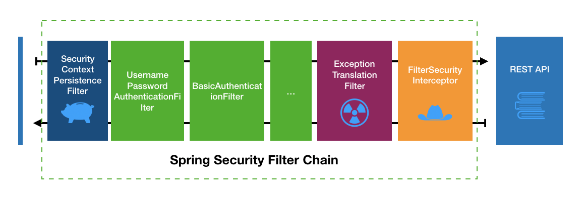

## 前言
Spring Seuciry相关的内容看了实在是太多了，但总觉得还是理解得不够巩固，还是需要靠知识输出做巩固。  

Spring Security简单地说，就是一个过滤器链，但详细理解下来又会觉得极其复杂，这和Spring的magic配置有着很大的关系。

## 过滤器链

在介绍认证流程之前，非常有必要讲解一下Spring Security的过滤器链。



我们可以从SpringSecurity的源码看到过滤器链的构造过程。DefaultSecurityFilterChain

```java

```

| 过滤器类 | 字符串表示 | 功能 |
| --- | --- | --- | --- |
| SecurityContextPersistenFilter | 无 | | |

- 默认配置
- 配置方法（如何生效）
- 覆盖方法
- 是否自动生效
- 过滤器链如何和系统进行连接

特殊讲解几个过滤器类

### SecurityContextPersistenFilter

### ExceptionTranslationFilter

### FilterSecurityInterceptor

- [ ] 如何卸载或者替换默认的Filter
- [ ] 一个前台成功之后，是否还会经过其他前台的处理
