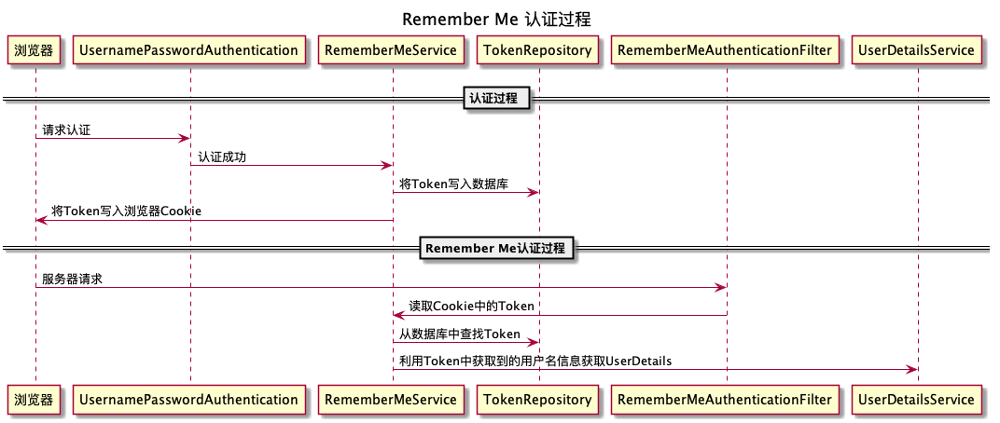
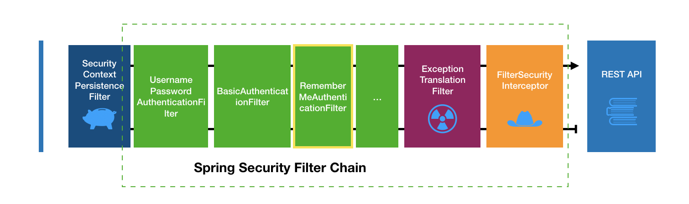

Remember Me
---

认证流程
---

**认证过程**



**在过滤器链的位置**  



服务器端开发配置
---

### 方案1：TokenBasedRememberMeServices

待研究

### 方案2（当前）：PersistentTokenBasedRememberMeServices

- TokenRepository

需要配置的数据表
```sql
-- 记住我功能用的表
create table persistent_logins (
    username varchar(64) not null,
	series varchar(64) primary key,
    token varchar(64) not null,
    last_used timestamp not null
    );
```

```java
@Override
protected void configure(HttpSecurity http) throws Exception {

    http.rememberMe()
        .tokenRepository(persistenceTokenRepository())
	.tokenValiditySeconds(3600)
	.userDetailsService(userDetailsService)
    ...
}

...

public PersistentTokenRepository persistenceTokenRepository() {
	// TODO 是否有redis的方案
	JdbcTokenRepositoryImpl tokenRepository = new JdbcTokenRepositoryImpl();
	tokenRepository.setDataSource(dataSource);
	// 启动的时候自动创建数据库表，也可以自己手动创建
	// tokenRepository.setCreateTableOnStartup(true);
	return tokenRepository;
}
```


客户端开发配置
---

```html
<div>
    <h2>标准登录页面</h2>
    <form action="/authentication/form" method="post">
    <table>
        <tr>
            <td>用户名:</td>
            <td><input type="text" name="username"></td>
        </tr>
        <tr>
            <td>密码:</td>
            <td><input type="password" name="password"></td>
        </tr>
        <tr>
            <td>图形验证码:</td>
            <td>
                <input type="text" name="imageCode">
                
            </td>
        </tr>
        <tr>
            <td colspan='2'><input name="remember-me" type="checkbox" value="true" />记住我</td>
        </tr>
        <tr>
            <td colspan="2"><button type="submit">登录</button></td>
        </tr>
    </table>
    </form>
</div>
```

默认Remember Me参数名为`remember-me`，后端代码可以配置参数名。

源码相关
---

```java
AbstractAuthenticationProcessingFilter#successfulAuthentication(HttpServletRequest request, HttpServletResponse response, FilterChain chain, Authentication authResult) {
    ....
    rememberMeService.loginSuccess(request, response, authResult);
    ....
}
```

参考
---

- [Remember-Me Authentication @SpringSecurity Doc](https://docs.spring.io/spring-security/site/docs/5.1.5.RELEASE/reference/htmlsingle/#remember-me)